# Design Decisions

A UX and UI record: the reasoning behind the experience, from the shopper's state
of mind down to the pixel values. Written from the design side — the engineering
counterparts are the [five ADRs](decisions/), and where a decision has both faces I
point at the record rather than repeat it.

The order here is the order the decisions actually happened in. Each one narrows the
next.

---

## 1. The shopper I designed for

**A shopper on a product page is not just reading. They are deciding whether to buy.**
The widget provides data-driven information that helps them decide, and improves
conversion for the merchant's store.

## 2. The biggest risk is not that it looks bad. It is that it is never seen.

The first threat I take seriously in this product is **banner blindness**.

**What it is.** A long-known web user behaviour: people's tendency to ignore page
elements they perceive — correctly or incorrectly — to be ads. Users have learned to
ignore content that resembles ads, sits close to ads, or appears in locations
traditionally dedicated to ads.

**It is measured, not a metaphor.** NN/g documented it in 1997 and replicated it by
eyetracking in 2007 and again in 2018 — three decades, same result.

**And it catches legitimate content.** Elements that merely carry ad-like
characteristics are filtered along with the real ads — which is the entire reason any
of this applies to a widget that is not an ad.

NN/g names three traits that signal *ad* to a reader:

- **A. Ad-specific placement** — the top of the page, or the right rail
- **B. Ad-like visual treatment** — animation, coloured backgrounds, fancy
  formatting, small rectangular shapes
- **C. Proximity to actual ads**

### A. Ad-specific placement

A sponsored result at the top of a Google results page, or a banner pinned to the
bottom of an Android app, are both good examples of ad-specific placement.

*Each red dot is one **fixation** — a moment where the eye stopped and rested, the
unit for* actually looked at. *The lines between them are saccades, during which a
person sees nothing. The sponsored result here collects none of them, and note where
it sits: **top of the page, above the fold, first in reading order.** The best
position available. It was not out-competed for attention; it was skipped, and what
identified it was how it looked.*

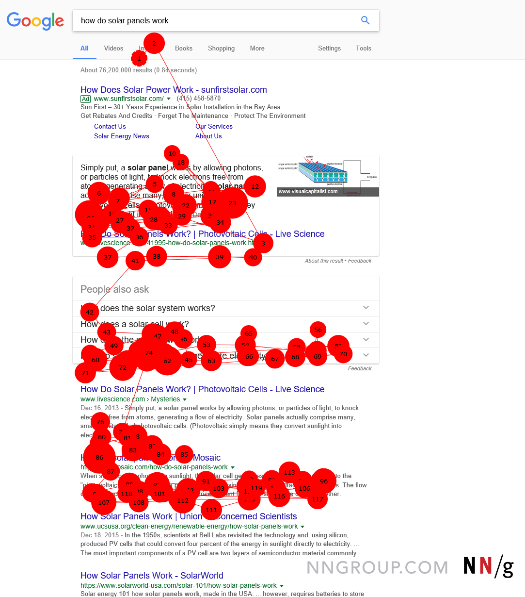


The scale of it, on a third page in the same study — a travel site, not the two shown
here: of the **132 fixations** a participant spent inside the content area, exactly
**one** landed in the right rail. That is 0.8% of their attention for 25% of the
area. Not "noticed less." A quarter of a page, functionally invisible.

*The same effect across 26 people on one page. Red marks the areas that got the most
fixations, yellow a moderate number, blue the fewest — and **areas with no overlay
colouring received no fixations at all.** The text was read heavily. The top banner
and the whole right rail have no overlay whatsoever.*

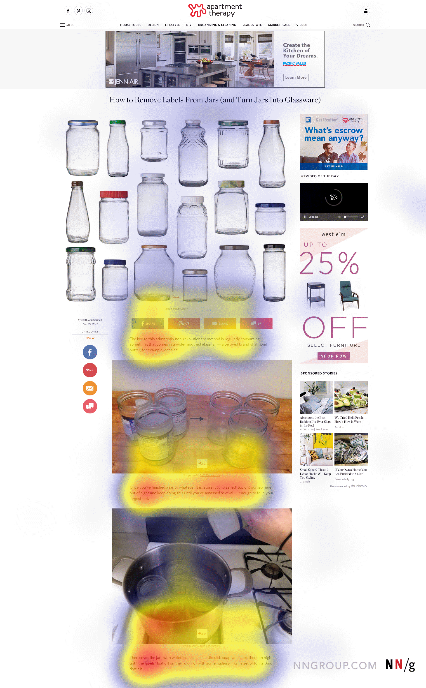


### B. Ad-like visual treatment — the trait my widget actually faces

Placement is the merchant's decision. Proximity is the merchant's decision. **How the
widget looks is mine alone**, which makes this the one trait I can fail at entirely on
my own — and the one worth designing against.


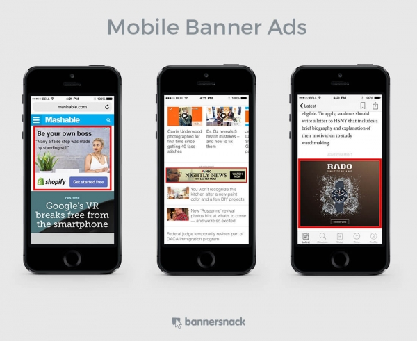

Look again at the Google gaze plot above. That ad had the *best* position on the
page — top, above the fold, first in reading order — and still collected nothing. Its
placement was ideal. What gave it away was how it looked.

**And "ad-like" is relative, not absolute.** This is the part that catches embedded
software specifically: **a widget does not have to look like an advertisement to be
filtered as one. It only has to look like it did not come with the page.**

NN/g state the trigger about as plainly as anyone could want:

> "Anything that stands out from immediate surrounding context is likely to be
> considered an ad."

*Immediate surrounding context.* The comparison is always against the neighbours —
never against some universal template of what an advertisement looks like.

So the signals fall into two kinds, and the second kind is the dangerous one.

**Ad-shaped almost anywhere:**

| Signal | Why it reads as an ad |
|---|---|
| A block at standard ad dimensions — 300×250, 728×90 | recognised before the content inside it is read |
| A bordered box with its own background, sitting inside the content column | the shape of nearly every promo unit on the web |
| A rounded card with a drop shadow, floating over flat content | the native idiom of advertising |
| Anything that moves on a page where nothing else moves | animation is the original banner signal |

A 300×250 block is read as an ad *whatever is inside it*. Shape alone is sufficient.

**Ad-shaped only here** — identical design, opposite outcome depending on the store:

| Signal | Native when | A seam when |
|---|---|---|
| Serif type | the store sets serif | the store sets sans-serif |
| A 12px corner radius | the store rounds to 12px | the store rounds to 4px |
| A white surface | the page is white | the page is cream — or dark |
| A warm amber accent | the palette is warm | the palette is cool or neutral |


Nothing in that second table is a mistake in isolation. Each one is wrong only
*relative to a page I have never seen* — and that is the whole problem: **there is no
single appearance that is native everywhere.** A widget shipping one fixed design is
guaranteed to be a seam on most stores it lands on, however carefully that design was
made. Being tasteful is not a defence; being tasteful in someone else's house is still
being a guest who dressed for a different party.

Which is why theming is not decoration in this product — it is the mechanism by which
the widget stays readable at all. It is also why "make the unconfigured defaults
neutral" is the first item in ADR 0005's queue rather than filed under polish: the widget
currently ships the sample storefront's serif, hairline and radius as its defaults, so
on every store that is not that one it asserts somebody else's design language.

Section 5 is the answer to the second table: nine tokens, and a configurator that sets
them.

### C. Proximity to actual ads

The trait I cannot control at all. Blindness spreads by association: a participant who
met sponsored stories in one site's right rail assumed the whole rail was advertising
and never looked at it again — losing the genuine content sitting beside them.

Since the merchant chooses where to mount the widget, they also choose its neighbours.
Land beside their promo strip and the widget inherits its blindness, having done
nothing wrong. Embed documentation is the only lever here, and documentation is the
weakest control there is.

So, across all three traits: **the widget's first job is to not look inserted.**
Not to be prominent, not to be beautiful in isolation, but to be unclassifiable as
third-party content — because this single thing decides whether the widget delivers
any of the business value in section 1. A highlight that is never read cannot help
anyone decide, and cannot convert.

This is argued in full, with what it costs and what the code still gets wrong, in
[ADR 0005 — Banner blindness and the visual seam](decisions/0005-banner-blindness.md).


## 3. What I looked at first

Before drawing anything I collected how this problem is already solved on stores
people actually use. Not for inspiration — for **evidence about the convention**.
Section 2 says the widget's job is to not look inserted, and "inserted" is defined
by what shoppers have already been trained on. That training is what these six
references document.

Two things I was reading for: **which patterns recur across otherwise unrelated
products** (those are the conventions I inherit whether I like them or not), and
**where each product draws the line between a fact and a promotion** — because that
line is the one section 2 says I must land on the correct side of.

### Nykaa — a named "Highlights" block

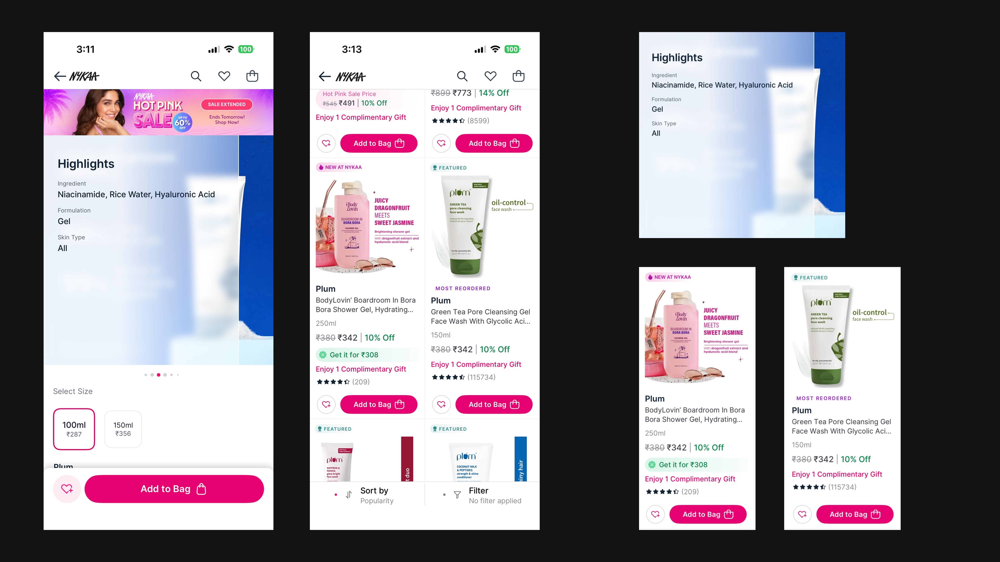

The feature already exists, under this exact name. Label above value, muted label
against ink value — hierarchy carried by **tone, not weight**, which is where the
widget landed too: 16px ink titles over 14.5px muted bodies, and no bold anywhere.
It sits over the product image with no container of its own.

Also the badge vocabulary: `NEW AT NYKAA`, `FEATURED`, `MOST REORDERED` as small
pills on the product card. That is the widget's badge placement, already
conventional. And at the top, the *Hot Pink Sale* banner — saturated, boxed,
promotional — is the thing section 2 says not to resemble, on the same screen.

### Slikk — the trust row, and specifications as a grid

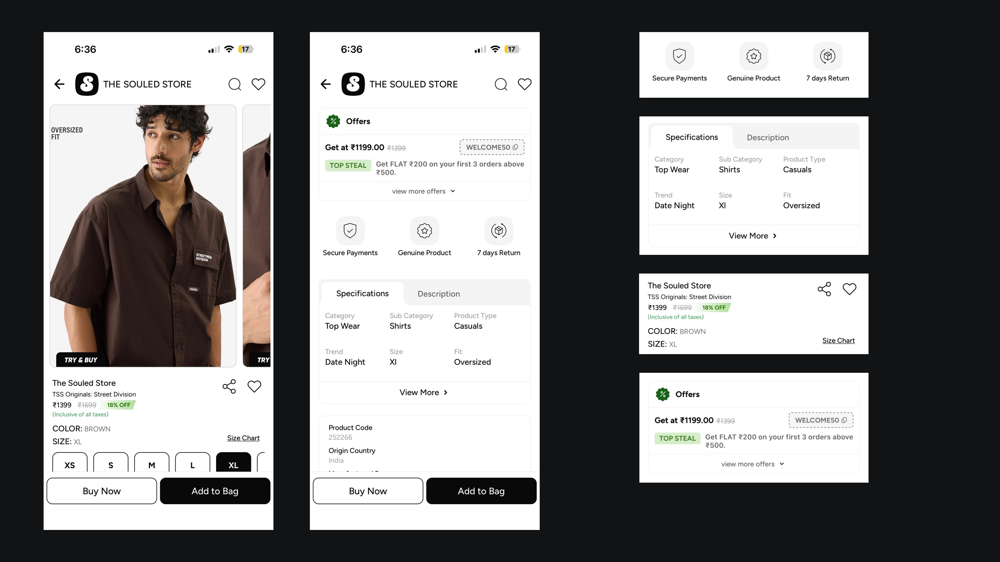

Two patterns worth taking. The **three-across trust row** — icon above a two-word
label, no body copy — is exactly the shape of the widget's `simple` layout, and it
works because those labels genuinely stand alone. The **specification grid** is
label-above-value again, three columns, hairlines rather than boxes between cells.

The `Offers` card with its green `TOP STEAL` pill is the counter-example: bordered,
filled, high-chroma, and unmistakably a promotion rather than a fact.

### Flipkart — "Product highlights", collapsible

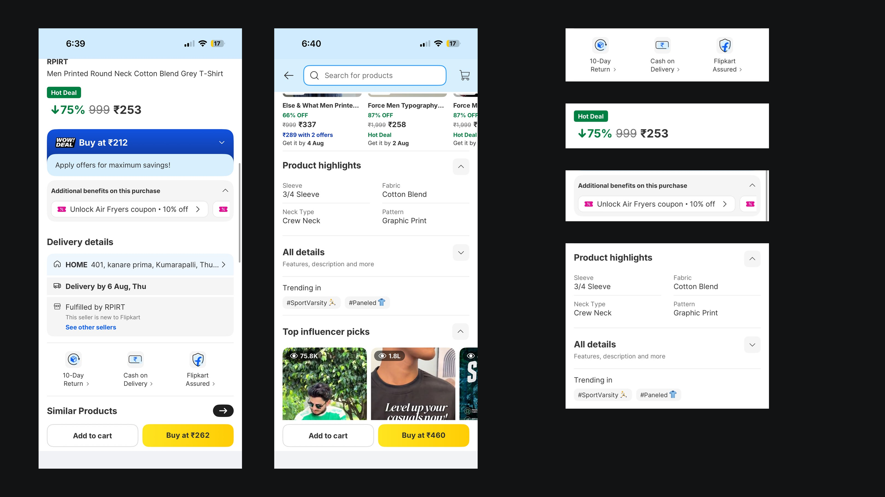

The nearest thing to a direct precedent — same feature, same name, as a two-column
label/value grid with hairline separators and a chevron to collapse. `All details`
below it carries a muted second line, which is progressive disclosure done honestly:
it tells you what is behind the control before you operate it.

It is also the busiest page here, and instructive for it. `Hot Deal`, `WOW! DEAL`,
and a pink coupon strip all compete above the highlights. Stacking promotions is how
a page teaches its own shoppers to skip that region.

### Airbnb — the closest reference to what I built

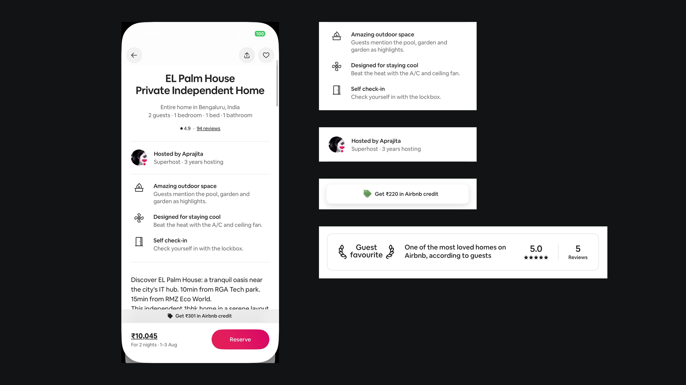

This is the one the default list is descended from. A stroke icon in a gutter, a
bold title, a muted sentence underneath — and **no container at all**. Hairlines
separate the group from what surrounds it; there is no card, no border, no fill.
That is the widget's hairlines-not-boxes rule, already load-bearing in a product
seen by millions.

The `Guest favourite` panel is the second borrowing: a claim, a divider, then the
numeral and the stars. That is the widget's rating panel, structurally. Note that it
is the *one* element on the page permitted a border — the numeric social proof
earns a container that the ordinary facts do not.

### Amazon — logistics facts, directly under the buy action

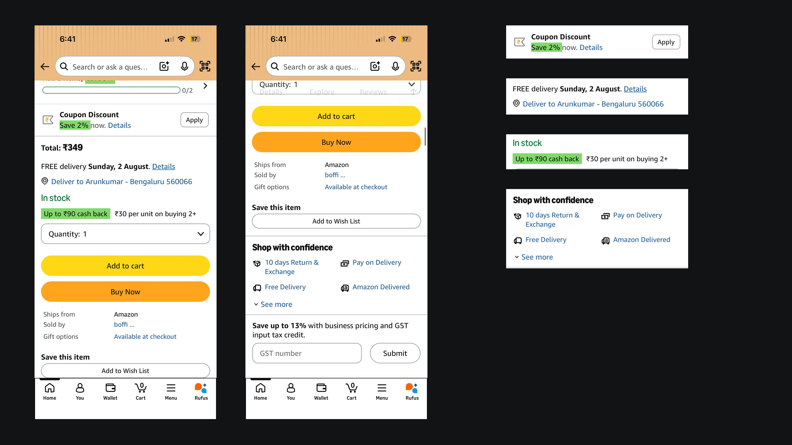

`Shop with confidence` sits immediately below *Add to cart* — a 2×2 grid of icon
plus short label, then `See more`. This is the placement argument in section 4
already settled by the largest store in the world: **the answers to purchase
hesitation belong next to the purchase.** Not in a tab, not further down the page.

Ships from / Sold by / Gift options above it is the same label-value pattern a third
time, which is what makes it a convention rather than a preference.

### The category itself — a trust-badge app and its configurator

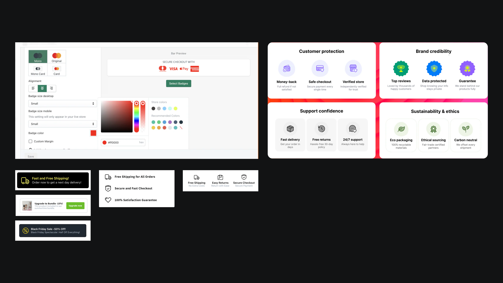

The existing product category, and the most useful reference of the six because it
shows both halves of the argument at once.

**The configurator half** validates the approach in
[`theme-panel.js`](../design-starter/theme-panel.js): style variants, alignment,
size, a colour picker, and a live preview. Note the swatches — **`Store colors`
offered alongside `Recommended Colors`.** Reading the merchant's own palette and
offering it back is a shipping idea, not a speculative one, which is the ground
[ADR 0005 §7](decisions/0005-banner-blindness.md) builds on.

**The output half is a warning.** The bars along the bottom split cleanly in two.
The quiet ones — icon, short label, muted subtitle — are facts. The dark bars with
saturated yellow text, and the one with a green `Upgrade now` button, are
advertisements wearing a widget's clothes. Same category, same install, opposite
side of section 2's line.

### What I took from all six

| Recurring pattern | Where it went |
|---|---|
| Label above value, muted against ink | the type scale — ink titles, muted bodies |
| Icon in a gutter, title, muted sentence | the default inline list |
| Hairlines between rows, no box around the group | hairlines above and below, and a `transparent` surface |
| Icon above a two-word label, three across | the `simple` layout |
| Purchase-hesitation facts under the buy action | the placement rule in section 4 |
| A container reserved for the numeric social proof | the rating panel |
| Boxed, filled, high-chroma, CTA-bearing | rejected — this is what section 2 measures |

The last row is the point. Every product here draws the same line, and draws it in
the same place: **facts are set quietly and inline; promotions get a box and a
colour.** A widget that arrives boxed and coloured has announced which of the two it
is before anybody reads it.

## 4. The central call: distribute the content, do not sequence it

The brief offered a reel, a stories-style sequence, an expandable set of cards, or
something else. I chose something else, and this is the decision the whole design
rests on.

**The five facts are not five of the same thing.** Read them as a designer rather
than as a payload:

| Item | What it actually is | Where a designer would put it |
|---|---|---|
| Delivery, guarantee, fit | answers to purchase hesitation | beside the buy action |
| Traceable merino | a claim about the object | on the product image |
| Loved by 3,100+ buyers | social proof | somewhere it earns a moment |

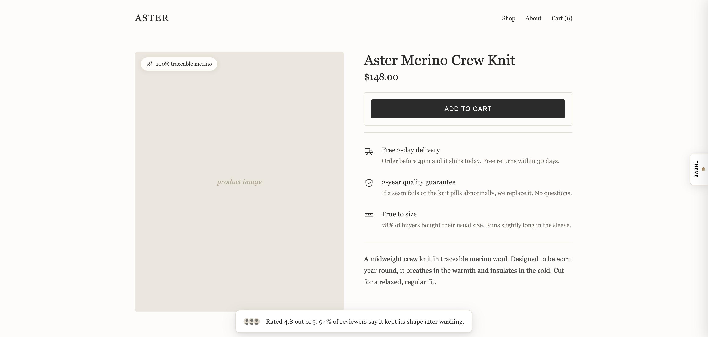

Any single sequenced container — reel, stories, carousel — asserts that these are
peers and that there is an order to move through them in. Both assertions are false,
and both cost the shopper something. So each item declares where it belongs and the
widget renders it there. ([ADR 0003](decisions/0003-declared-placement.md) covers the
mechanism and the fallback rule.)

### Why I rejected each named form

**A swipeable reel.** It puts the content behind a gesture. Four of five items are
then invisible until the shopper decides to work for them, at the exact moment they
have the least appetite for work. Carousel blindness is the same filter as section 2
applied to a moving surface, and the measured outcome for carousels is that content
past the first frame is close to unread. I am not going to hide four true things
behind a swipe to gain a layout that is more fun to build.

**A stories-style sequence.** Auto-advancing, timed, full-attention. It is a
borrowed pattern — the borrowing is from a context where the user opened the thing
deliberately and wants to be entertained. A shopper comparing sleeve lengths did not
open anything. Stories also take the clock out of the shopper's hands, which is the
one thing the brief explicitly asks not to do.

**An expandable set of cards.** The most defensible of the three, and the closest
call. Rejected as the *default* for two reasons: five collapsed rows are five
decisions to make before any information arrives, and a card is a box — the shape
section 2 warns about. It survives as the opt-in `accordion` layout for payloads too
long to sit open, which is the case where its cost is worth paying.

**What I built instead:** everything visible at once, nothing to operate, arranged
so that each fact sits where its question is asked. The most radical thing about the
default is that there is no interaction in it at all.

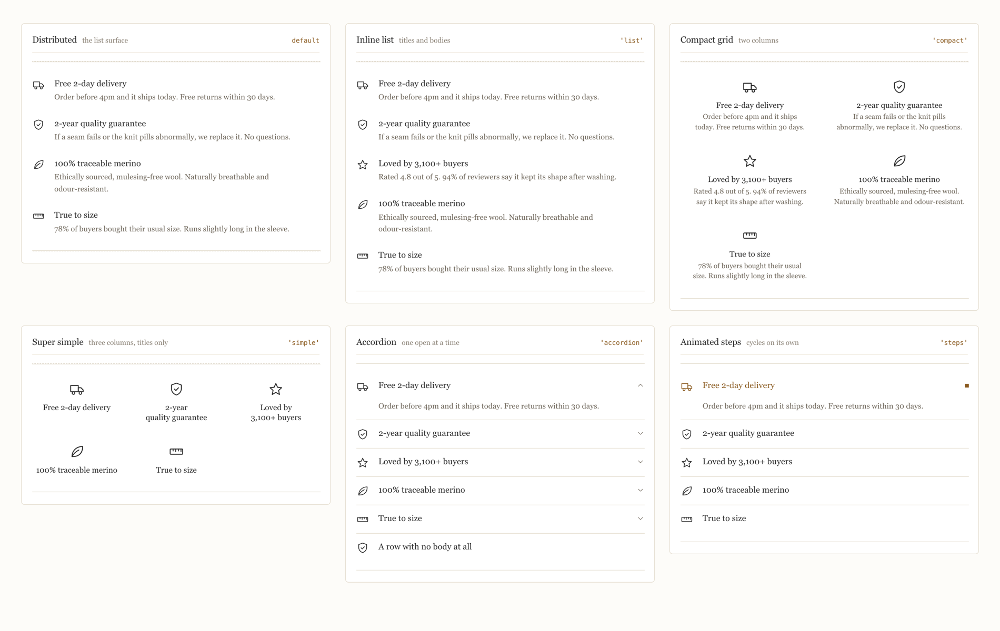

## 5. Theming — the merchant decides how it looks

Section 2 ends on a problem this section answers. If "ad-like" is relative, and no
single appearance is native everywhere, then a widget with one fixed design is a seam
on most stores it lands on. **The only way out is to let the page decide.**

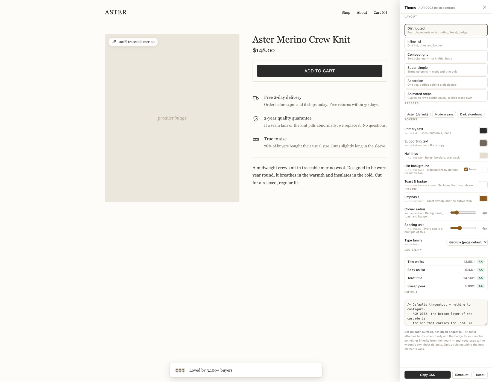

So the widget exposes **nine tokens** and nothing else:

```css
--hl-surface        --hl-ink         --hl-border    --hl-radius   --hl-space
--hl-surface-raised --hl-ink-muted   --hl-shimmer   --hl-font
```

Small on purpose. A narrow contract is one that can be supported and reasoned about;
an open one turns every internal styling decision into public API. Nine is enough to
re-theme the widget completely — [stress page 03](../stress/03-dark-theme.html) does
exactly that, dark palette and Helvetica and 10px radius, and nothing structural
changes.

**The configurator is the design work, not a demo.** Setting nine CSS custom
properties by hand is a thing almost no merchant will do, so the panel writes them:
every control live, a WCAG AA grade on every colour pair the *selected layout
actually renders*, and the finished CSS block ready to copy.

Three decisions inside it worth naming:

- **It grades only what is on screen.** A pair that the current layout never renders
  is not graded, because a failing score for something invisible is noise.
- **It reports a failing pair rather than silently substituting.** Discarding what
  somebody just typed reads as a broken control. At the payload boundary, where
  nobody is watching, substitution is correct — but not here.
- **It asks the build what it can do.** `mount` exports the layouts it renders and
  the panel offers exactly those; on the React page the layout controls appear
  *disabled with the reason*. A control that silently does nothing is worse than one
  that says it cannot.

It is a merchant tool, not part of the widget: **zero bytes in the bundle**, and
deleting its script tag removes it entirely. It only sets the public custom
properties — the same channel a stylesheet would use.

It is also the only place the contrast gate *can* live. Custom properties are applied
by the browser directly, so at that layer there is nothing to intercept; a
configurator is the first point in the cascade where a value exists before it is used.
That is also the argument for putting *inference* there later —
[ADR 0002 →](decisions/0002-theming-and-native-feel.md) ·
[ADR 0005 §7 →](decisions/0005-banner-blindness.md)

## 6. The rest of it, and how I checked

Four things I did not want to lose track of, and the suite that holds them to account.

**Responsive across devices.** Layout responds to the **container, never the
viewport** — a 1440px desktop can hand this widget 300px and a phone can hand it the
full width, so any rule keyed to window size is answering a question nobody asked.
Columns come from `auto-fit` with a sane track minimum, so a narrow container drops a
column rather than crushing the line length. Four or more items always stack.

**Colour and keyboard access.** Every externally supplied colour pair is validated
against **WCAG AA** — 4.5:1 body, 3:1 large — and rejected if it fails, because being
slightly off-brand is recoverable and being illegible is not. Nothing depends on
colour alone. `all: initial` takes the UA focus ring with it, so it goes back
explicitly; every control is a real `<button>` with `aria-expanded`; the rating is one
`role="img"` labelled *Rated 4.8 out of 5* rather than three things read in turn; and
`forced-colors` is handled per surface.

**Usability.** Pacing stays with the shopper. The default list is **static** — nothing
advances, nothing waits, nothing needs operating, so there is no speed to control. The
toast never dismisses on a timer, holds while a pointer is over it or focus is inside
it, and resumes on the *remainder* of its dwell rather than a fresh one. Dwell is set
by the content — `clamp(2400, chars × 62, 6500)`ms — because reading time is a
property of the text. The one self-advancing layout stops permanently at the first
click. Reduced motion removes movement, not content.

**UI states.** The states that matter here are the bad ones: no anchor, an invalid
selector, a duplicate claim, a 404, malformed JSON, the right JSON in the wrong shape,
a payload of rubbish. Every one of them has a defined outcome, and the rule is single:
**anything that cannot be placed falls back to the list, and nothing renderable means
nothing rendered** — no empty box, no reserved space.

### The stress suite — seven pages built to break it

The mock storefront proves the widget works on a page designed to suit it. These are
pages designed not to. Each states its own pass condition inline, and each runs the
build that actually ships.

**01 · Hostile CSS** — `!important` on every generic class the widget uses, plus
element selectors on `div/p/span/svg/ul`.

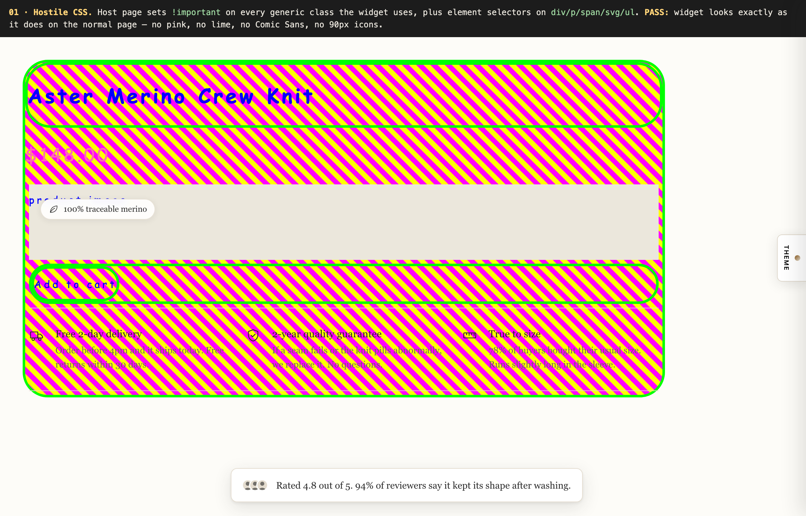

**02 · Transformed ancestor** — `transform` → `filter` → `perspective` →
`contain:paint` nested above the mount, the arrangement that breaks `position: fixed`.

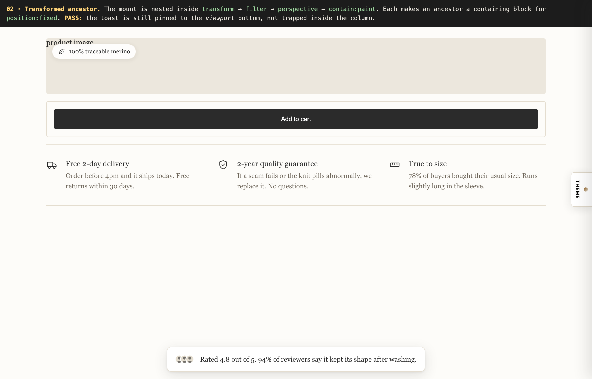

**03 · Dark storefront** — light-tuned defaults on a dark page, beside a themed twin.
The honest one: it shows the unconfigured widget as a bright hole, and the same
widget with nine tokens set looking native.

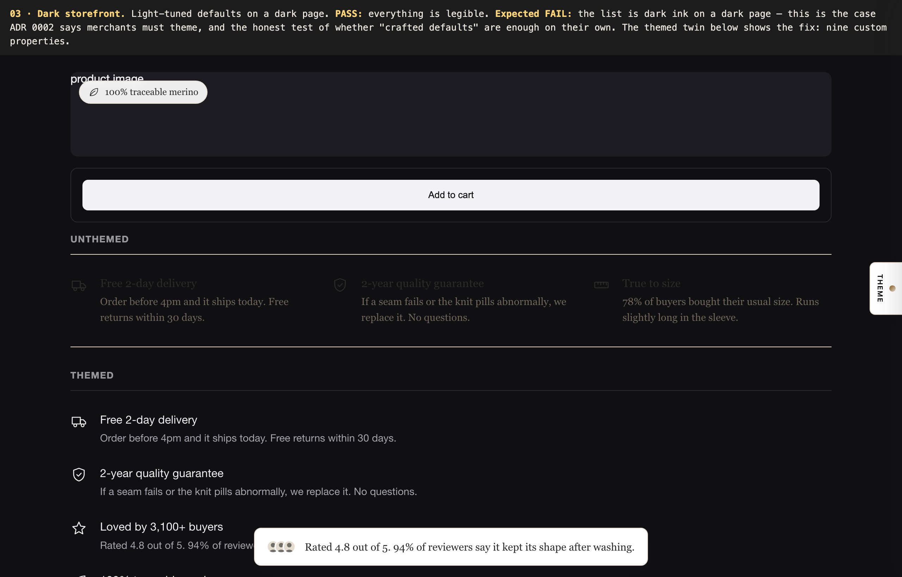

**04 · No anchor, bad selectors, duplicate claims** — missing anchor, invalid
selector, two toasts, two ratings, an unknown placement. Everything demotes to the
list.

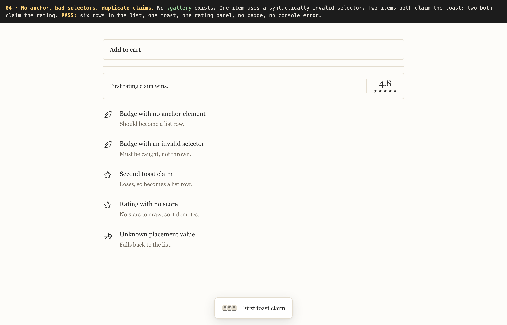

**05 · 320px column, RTL** — the narrowest realistic column under `dir="rtl"`.

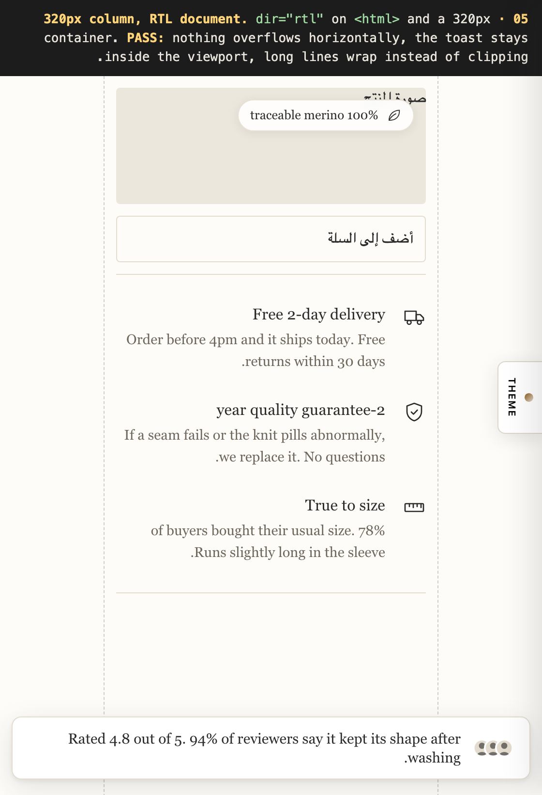

**06 · Strict CSP** — `style-src 'self'`, which blocks inline `<style>` and `style=""`
alike. The widget adopts a constructed stylesheet instead, so it survives.

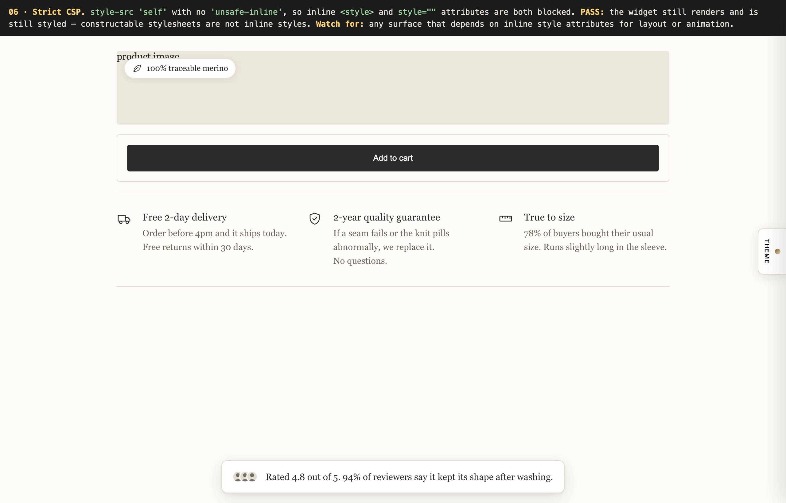

**07 · Broken payloads** — a 404, invalid JSON, right JSON in the wrong shape, an
array of rubbish, a mount selector matching nothing.

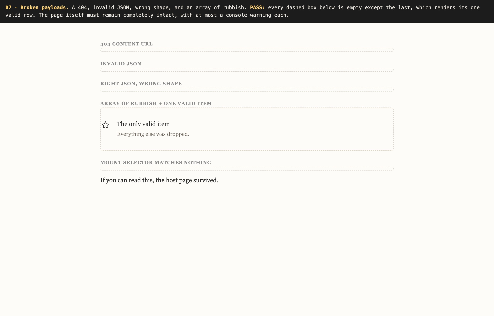

That last screenshot is the one I would point at first. Four empty boxes, one valid
row recovered from an array of rubbish, and the host page intact underneath —
**failing safely is a design outcome, not only an engineering one.** A shopper never
sees a broken component, and a merchant never sees their page damaged by something
they installed.

Two more pages re-run the first two hazards against a React build of the same widget,
with the host page held constant so the build is the only variable. That is a
measurement rather than coverage, and it is written up in
[stress/README.md](../stress/README.md) — including the results that do not flatter
the choice I made.

## The records

The engineering face of each of these, with the alternatives rejected and the
consequences accepted:

| | |
|---|---|
| [ADR 0001](decisions/0001-style-isolation.md) | Style isolation — why every surface gets its own shadow root |
| [ADR 0002](decisions/0002-theming-and-native-feel.md) | Theming and native feel — the nine-token contract |
| [ADR 0003](decisions/0003-declared-placement.md) | Declared placement — four surfaces, and the fallback rule |
| [ADR 0004](decisions/0004-layout-from-the-measure.md) | Layout from the measure — why the columns break where they do |
| [ADR 0005](decisions/0005-banner-blindness.md) | Banner blindness — why theming is an attention problem |
